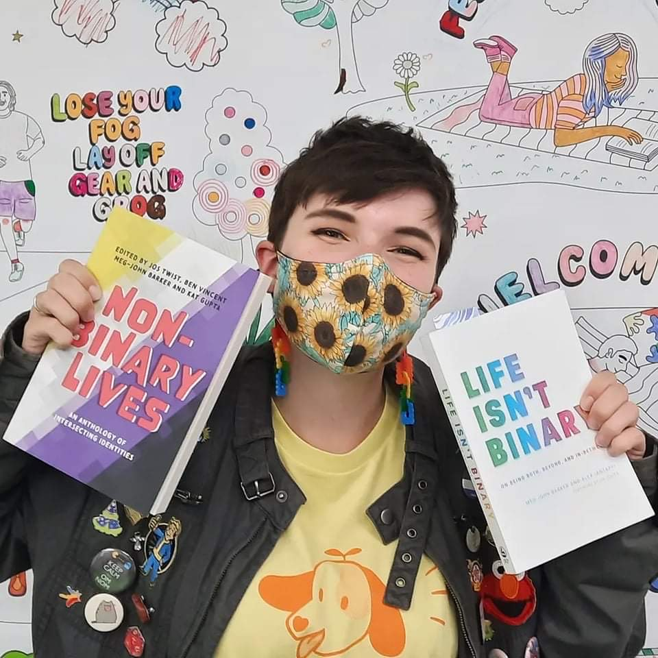

---
# set the layout to use, in this case, the homepage one
layout: layouts/homepage

# We can set extra info here to use in our templates

hero:
    title: Hi, my name is Beth!
    subtitle: (they/them)

quality1:
    driven: 

---
<!--content displays here - must be below the three dashes --> 

### I’ve created this website to give you a snapshot into my life and, hopefully, convince you that I’m somewhat accomplished.

### Qualities <!--would like to have all 3 qualities in card side by side - not sure how to do that-->

#### DRIVEN 
- No matter the task, I am determined to complete it to the best of my ability. I am always striving to go beyond expectations and acquire new skills. If you need help, I’ll be the first to lend a hand. 
- If I’m ever unsure about something, I follow it up. I’ll ask questions and research beyond work hours to complete my duties with reason and ensure I never default to ‘just because’. 
<!-- according to the mardown cheat sheet '-'s should be how I create a list but this doesn't seem to be the case.. seems to separate them by line though-->

#### CONVERSATIONALIST
- If there’s one thing I love to do above anything else, it’s socialise. I am incredibly extraverted and will often spark up conversation with enough enthusiasm to power a lightbulb. I flourish working among people. 

#### CREATOR
- I’m quite the tinker. Most of my skills lie in the creative arts. I’ve painted murals, created advertising, crafted brooches, donated artworks and, most impressively, knitted a sweater. I’ve also dabbled in carpentry, interior design, and sewing. I’m blessed with itchy hands and a brain bursting with ideas, so I figure why not use them!

### Recent Endeavors <!--would like to have as a separate strip-->
- **March 2022** <!--supposed to be BOLD but isn't >:( -->) – Painted a mural for Revelation Puzzle Rooms
- **November 2021** to January 2022 – Painted a mural for headspace Canberra
- **November 2021** to December 2021 – Facilitated dogspace on a weekly basis in collaboration with Delta Dogs at headspace Canberra 
- **December 2021** – Volunteered as a member of BitBent to pack Christmas Hampers for Capital Region Community Services (CRCS)
- **December 2021** – Volunteered at the Geek Markets at Exhibition Park (in Canberra)
- **June 2021** – Designed the box art for Kickstarter board game, Vanished.
- **May 2021** – Organised and facilitated a movie night event at the Belconnen Youth Centre on behalf of headspace Canberra
- **May 2021** – Completed first teaching placement at Canberra Girls Grammar Senior School
- **May 2021** – Volunteered at the Geek Markets at Exhibition Park (in Canberra)

### Current Study

### Current Work <!--I would like to present each job as a boxed element (kind of like a card)-->
#### CANTEEN ASSISTANT | MACGREGOR PRIMARY SCHOOL | MARCH 2022 – CURRENT
Duties: <!--positioned to left of box-->
- Prep lunch orders for packing (e.g., organising change, cutlery and condiments)
- Assist in food prep and packaging
-Ensure hygiene and COVID-19 practices are implemented and followed (e.g., taking class orders instead of have individual children order over the counter, washing hands between tasks such as handling money and washing dishes and adhering to colour-coded systems for food prep and clean up) 

Summary: <!--positioned to the right of the box-->
In response to an increasing number of lunch orders, I offered to assist the canteen during peak periods. My work with them has greatly informed my hygiene practices and has increased my ability to accomplish tasks quickly and efficiently.

#### OUT OF SCHOOL HOURS CARE | MACGREGOR PRIMARY SCHOOL | FEBURARY 2022 – CURRENT
Duties:
- Supervise and facilitate learning activities
- Observe and document meaningful moments with children and draw from these observations to inform learning activities
- Collaborate with educators to create activities that respond to the children’s learning goals
- Provide healthy snacks that align with The National Healthy School Canteen Guidelines 
- Ensure current COVID-19 policies are implemented and followed (e.g., separating cohorts to limit contact, ensuring indoor spaces are well ventilated for indoor activities and serving children food with gloves and tongs) 

Summary:
My work with the Out of School Hours Care (OSHC) at Macgregor Primary School is incredibly rewarding. It’s wonderful to be able to work closely with children from Preschool to Year 6 and speak to them about their wants and needs to inform my practice as an educator. Although my time with them has been brief thus far, I have improved my skills managing diverse groups of children and resolving conflicts when they arise. I have grown a deep appreciation for the care each of the educators hold for the children and the flexibility the program offers to cater to the children’s learning goals when brainstorming activities for the coming week.   

#### YOUTH ADVOCATE | HEADSPACE CANBERRA | FEBURARY 2017 – CURRENT
Duties:
- Assist in the planning and organisation of events and workshops aimed at youth aged 12-25.
- Attend regular meetings to reflect on past endeavors and discuss future projects.
- Represent headspace Canberra at functions including school events, festivals and exhibitions.

Summary:
Since 2017, I’ve been a member of the Youth Reference Group (YRG) at headspace Canberra. This group aims to spread awareness of mental illness and promote positive wellbeing by representing and engaging with Canberra’s youth. As a member, I have facilitated youth-led events and workshops, spoken to leaders of other organisations regarding youth (such as Women with Disabilities Australia), represented headspace at functions and aided headspace in maintaining relevance by joining interview panels, reviewing the website design and contributing to headspace Canberra’s interior design.

As of 2022, my role at headspace Canberra has changed. I have been accepted into the Youth Ambassadors Program (YAP) which will grant me the opportunity to engage and develop programs for youth with diverse backgrounds that stem far beyond my limited and privileged perspective. Some of these opportunities include working with Aboriginal, homeless and refugee youth. My hope by joining the YAP is to broaden my perspective and knowledge so that I may someday become an educator who can provide an inspired and inclusive education for all young people no matter their story. 

<!--add images and social media icons and links after-->

